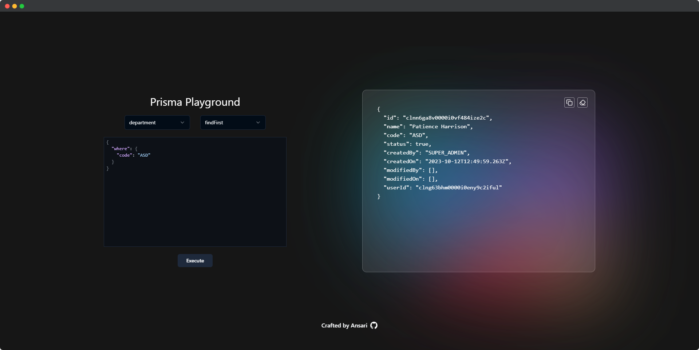

<div align="center">

 <p style="font-size:30px;font-weight:bold">Prisma Playground</p>
</div>

## Overview

Prisma Playground is a web-based tool that allows you to execute Prisma commands directly in your browser. It provides a user-friendly interface to interact with your Prisma schema, execute queries, and see results in real-time.

## Getting Started

To set up the project, follow these steps:

1. Install dependencies:

   ```bash
   bun install
   ```

2. Place your `schema.prisma` file in the `prisma` folder.

3. Generate Prisma client:

   ```bash
   prisma generate
   ```

4. Build the project:

   ```bash
   bun run build
   ```

5. Start the application:

   ```bash
   bun run start
   ```

## Features

- **Interactive Interface:** Select tables and queries using dropdowns for a seamless experience.

- **Real-time Execution:** Execute queries directly from the browser, and receive real-time results.

- **Syntax Highlighting:** Leverage CodeMirror for syntax highlighting and error checking when entering query conditions.

- **Clipboard Integration:** Easily copy query results or errors to the clipboard with a click.

- **Clear Output:** Clear the output area to keep the interface tidy.

- **Error Handling:** Receive error notifications in case of query execution errors.

## Usage

1. Select a table and a query from the dropdown menus.
2. Enter query conditions in the provided CodeMirror editor.
3. Click the "Execute" button to run the query.
4. View the results, copy them to the clipboard, or clear the output as needed.

## Screenshots


## Contributing

Feel free to contribute to the project by submitting bug reports, feature requests, or pull requests. Your feedback and contributions are highly appreciated.

Crafted with ❤️ by Ansari. [Say Hi! 👋🏻](https://twitter.com/am5orry)

## License

This project is licensed under the [MIT License](LICENSE).